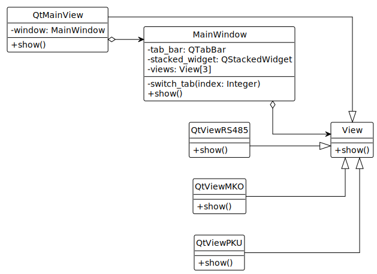

# Графический пользовательский интерфейс

## Сборка

Полная сборка выполняется с помощью скрипта ```build.sh```. Исполняемый файл — ```src/build/out/ui```.

## Очистка

Полная очистка выполняется с помощью скрипта ```clean.sh```.

## Декомпозиция



Интерфейс общий для работы со всеми драйверами.

```QtViewRS485``` — вкладка для RS-485.

```QtViewMKO``` — вкладка для МКО.

```QtViewOKU``` — вкладка для РК/ПКУ.