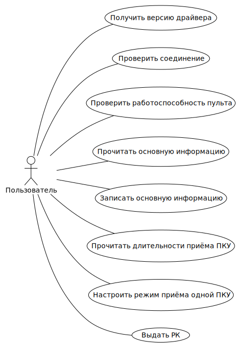
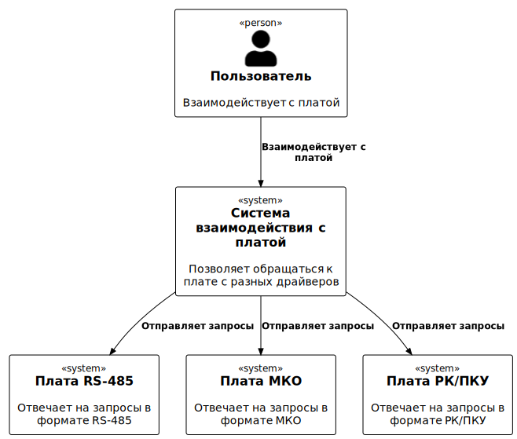
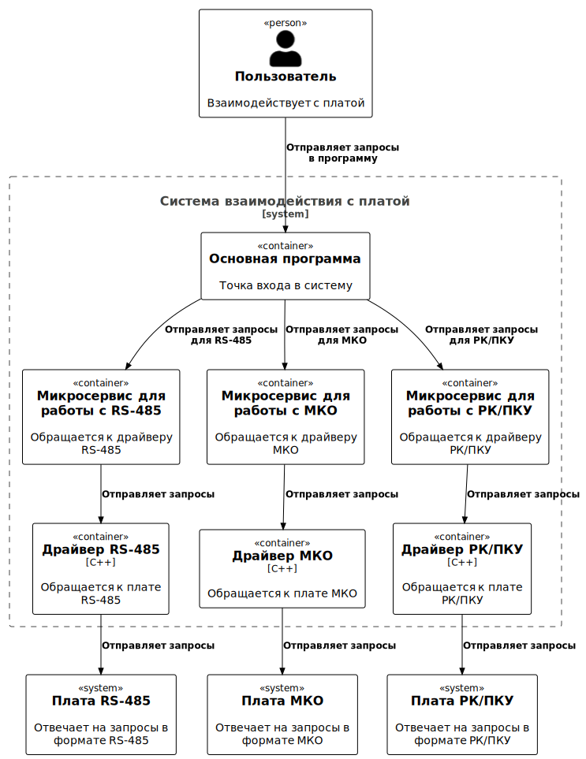
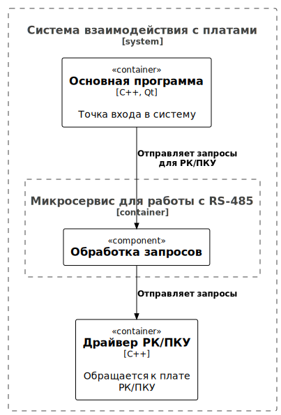

# Микросервис для драйвера РК/ПКУ

## Диаграмма вариантов использования



## Диаграммы C4

### Диаграмма контекста



### Диаграмма контейнеров



### Диаграмма компонентов



## Директории

Директория ```api``` содержит интерфейсы, по которым генерируется код gRPC.

Директория ```driver``` содержит код заглушки драйвера для тестирования.

Директория ```service``` содержит основной код микросервиса.

## Сборка

### Linux

Генерация кода gRPC выполняется с помощью скрипт ```api/generate.sh```.

Cборка без генерации кода gRPC выполняется с помощью скрипта ```build.sh```.

### Windows

В директории, где находится файл ```CMakeLists.txt``` вызываются команды, аналогичные скрипту ```build.sh```.

```bat
mkdir build
cmake -B build
cmake --build build
```

## Очистка

### Linux

Очистка кода gRPC выполняется с помощью скрипта ```api/clean.sh```.

Очистка результатов сборки, не включая код gRPC, выполняется с помощью скрипта ```clean.sh```.

### Windows

Для очистки достаточно удалить директории ```build``` и ```log```.

```bat
rmdir build log
```

## Запуск

### Linux

Драйвер запускается с помощью исполняемого файла ```build/driver```.

Микросервис запускается с помощью скрипта ``service/run.sh````.

### Windows

Драйвер запускается с помощью исполняемого файла ```build/driver```.

Микросервис запускается с помощью команды ```python main.py``` из директории ```service```.
